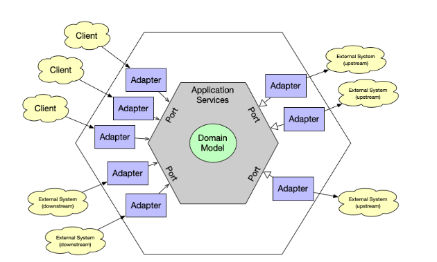

# 비즈니스 로직과 아키텍처 패턴

비즈니스 로직은 소프트웨어에서 가장 중요한 요소이다. 하지만 소프트웨어 시스템에는 그밖에도 많은 요소들이 있다. 데이터베이스, 사용자 인터페이스, 외부 연동, 기능, 비기능적 요소들이 협력되어 작업한다.

이렇게 다양한 관심사들로 인해 비즈니스 로직이 다른 영역으로 분산될 수 있다. 결국 하나의 변경이 예상치 못한 곳에 영향을 준다거나 변경해야 할 곳을 찾지 못할 수도 있다. 이렇듯 유지보수를 위해 관심사들의 명확한 경계가 필요하다. 

이러한 경계를 만들어 줄 수 있게 해준듣 세 가지 주요 아키텍처 패턴인 **계층형 아키텍처**, **포트와 어댑터**, **CQRS** 를 살펴보자.

# 1. 계층형 아키텍처(layered architecture)

계층형 아키텍처는 가장 일반적으로 사용되는 아키텍처이다. 코드베이스를 수평 계층으로 조직하고, 의존성의 방향을 상단에서 하단으로 단방향이다. 


## 프리젠테이션 계층

프리젠테이션 계층 사용자와 가장 밀접하게 상호작용하는 계층이다. 사용에 대한 예시는 다음과 같다. 

- **그래픽 사용자 인터페이스(GUI)**
- **커맨드 라인 인터페이스(CLI)**
- **다른 시스템과 연동하는 프로그래밍 API**
- **메시지 브로커에서 이벤트에 대한 구독**
- **나가는 이벤트를 발행하는 메시지 토픽**

## 비즈니스 로직 계층

이름으로도 알 수 있듯이 비즈니스 로직이 주를 이루는 계층이다. 액티브 레코드나 도메인 모델이 이 계층에 포함된다. 

## 데이터 접근 계층

기존에는 데이터 접근 계층은 시스템의 데이터베이스를 의미했지만 현대 시스템에서는 다양한 데이터베이스들이 출현했고 비동기 통신을 위한 메시지 브로커 등이 이 계층에 해당한다.

## 변종(variation)

계층형 아키텍처 패턴을 확장해서 **서비스 계층**을 추가할 수 있다.

### 서비스 계층

<aside>
💡 가용한 오퍼레이션을 구축하고 각 오퍼레이션에서 애플리케이션의 응답을 조정하는 서비스 계층을 애플리케이션의 경계에 정의한다.

</aside>

서비스 계층은 **프레젠테이션 계층과 비즈니스 로직 계층 사이의 중간 역할**을 한다.

서비스 계층은 두 계층 사이의 논리적 경계를 만들어준다. 둘 사이의 **관문** **역할**을 하여 조율한다. 프레젠테이션 계층은 서비스 계층에게 요구되는 입력 값을 전달하고 서비스 계층은 그 결과를 반환하는 것까지만 책임을 가진다.

서비스 계층을 만듦으로써 몇 가지 장점을 가지게 된다. 

- **퍼블릭 인터페이스의 재사용이 가능하다.**
- **비슷한 기능들로 모듈화 진행이 가능하다.**
- **비즈니스 긴으을 테스트하기 쉬워진다.**
- **프레젠테이션 계층과 비즈니스 로직 계층간의 결합도를 낮춘다.**

## 계층형 아키텍처를 사용하는 경우

계층형 아키텍터를 사용하는 경우는 비즈니스 로직과 데이터 접근 계층과 의존성이 있을 때 사용하면 된다. 트랜잭션 스크립트나 액티브 레코드 패턴이 이 경우다. 하지만 도메인 모델은 적합하지 않을 수 있다. 왜냐하면 비즈니스 엔티티(에그리게이트, 벨류 오브젝트)는 인프라 스트럭처를 전혀 몰라야 하기 때문이다. 

도메인 모델과 적합한 패턴은 다음에 나오는 패턴이다.

# 2. 포트와 어댑터(port & adapter)

**포트와 어댑터(port & adapter)** 아키텍처는 계층형 아키텍처의 순수한 비즈니스 로직을 가질 수 없다는 단점을 해결하고 좀 더 복잡한 비즈니스 로직을 구현하는 데 적합하다.

### 용어

프리젠테이션 계층과 데이터 접근 계층 모두 외부와 연동한다는 것이 동일하다. 포트와 어댑터 패턴에서는 이러한 외부 연동 계층을 **인프라스트럭처 계층**으로 한 곳에 묶는다.

### 의존성 역전 원칙

의존성 역전 원칙(Dependency Inversion Principle)에서 비즈니스 로직을 구현하는 상위 수준의 모듈은 하위 수준의 모듈을 의존해서는 안된다고 말한다. 기존의 계층형 아키텍처 패턴은 **비즈니스 로직 계층 → 데이터 접근 계층**을 의존하는 구성이다. 이제 이 의존성을 인터페이스를 이용하여 반대로 돌린다. **비즈니스 로직 계층 ← 데이터 접근 계층** 그리고 중간의 관문이자 조율을 위해 서비스 계층을 넣어준다. 

**비즈니스 로직 계층 ← 애플리케이션 계층 ← 인프라스트럭처 계층**

이로써 비즈니스 로직 계층은 어떠한 계층도 의존하지 않는다.

## 인프라 구성요소의 연동

포트와 어댑터 아키텍처의 핵심 목적은 인프라스트럭처 구성요소로부터 시스템 비즈니스 로직을 분리하는 것이다. 

비즈니스 로직 계층은 인프라스트럭처 계층이 구현해야 할 ‘**포트**’ 즉, 인터페이스를 정의한다. 인프라스트럭처는 포트의 구현체인 ‘**어댑터**’를 구현하다.



예를 들어, 비즈니스 로직 계층은 아래와 같이 **포트**를 정의한다.

```java
public interface IMessaging {
	void Publish(Message payload);
	void Subscribe(Message type, Action callback);
}
```

인프라 스트럭처 계층은 위의 포트의 구현체를 정의한다.

```java
public class SQSBus implements IMessaging {
	void Publish(Message payload) {
		...
	}
	void Subscribe(Message type, Action callback) {
		...
	}
}
```

## 변형

포트와 어댑터는 헥사고날(hexagonal) 아키텍처, 어니언(onion) 아키텍처, 클린 아키텍처로 알려졌다. 모두 동일한 설계 원칙을 기반으로 하고 동일한 구성 요소를 가진다. 단순히 각각의 용어가 다르다. 

- **애플리케이션 계층 = 서비스 계층 = 유스케이스 계층**
- **비즈니스 로직 계층 = 도메인 계층 = 핵심 계층**