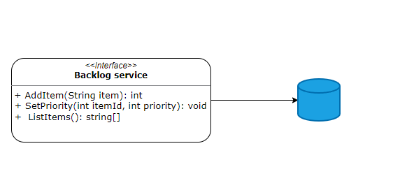

# 간단한 비즈니스 로직 구현

비즈니스 로직은 소프트웨어에서 가장 중요한 부분이다. DB가 확장이 가능하던 UI가 매력적이던 간에 소프트웨어가 비즈니스에 쓸모가 없다면 값비싼 기술 데모에 불과하다.

각 하위 도메인마다 전략적 중요성과 복잡성이 다른데. 이때 비즈니스 로직 코드를 모델링하고 구현하는 두 가지 패턴인 **트랜잭션 스크립트**와 **액티브 레코드 패턴**을 살펴보자.  

## 트랜잭션 스크립트

<aside>
💡 프리젠테이션으로부터 단일 요청을 처리하는 여러 프로시저를 모아서 비즈니스 로직을 구현하라.
                                                                                                                       **- 마틴 파울러(Martin Fowler)**

</aside>

시스템의 퍼블릭 인터페이스는 아래와 같이 사용자가 실행할 수 있는 비즈니스 트랜잭션의 모음이라고 볼 수 있다. 



**트랜잭션 스크립트 패턴**은 프로시저를 기반으로 비즈니스 로직을 구성한다. 트랜잭션 스트립트 패턴의 **프로시저**의 의미는 **비즈니스 로직을 구현하는 단위**이다. 퍼블릭 인터페이스의 구현 코드라고 보면된다. 그러면 이러한 프로시저는 어떻게 구현돼 있을까?

### 구현

각 프로시저는 절차지향 스크립트(procedural script) 로 구현된다. 이 프로시저의 가장 중요한 부분은 **트랜잭션 동작**이다. 작업이 성공하거나 실패할 수 있으나 항상 **원자성과 일관성**을 유지해야 한다.

다음은 JSON 파일들을 XML 파일로 변환하는 트랜잭션 스크립트이다.

```jsx
DB.StartTransction(); // 트랜잭션

var job = DB.LoadNextJob();
var json = LoadFile(job.Source);
var xml = ConvertJsonToXml(json);
WriteFile(job.Destination, xml.ToString();
DB.MarkJobAsCompleted(job);

DB.Commit();
```

### 트랜잭션 동작 실패

트랜잭션 동작을 실패하는 여러 가지 상황이 있는데. 그 중 하나인 간단한 예는 여러 업데이트를 트랜잭션 없이 하는 경우이다. 

User 테이블에 Update 쿼리를 날리고 VisitsLog 테이블에는 Insert 쿼리를 날리는 상황이다.

```jsx
// 트랜잭션 X
public void Execute(Guid userId, DataTime visitedOn) {
	_db.Execute("UPDATE Users SET last_visit=@p1 WHERE user_id=@p2, visitedOn, userId);
	_db.Execute("INSERT INTO VisitsLog(user_id, visit_date) VALUE(@p1, @p2)" userId, visitedOn);
}
```

**트랜잭션 처리 없이 UPDATE, INSERT** 쿼리가 실행되는 상황이다. 만약 UPDATE 처리 이후 에러가 발생하면 INSERT 처리는 진행되지 않고 UPDATE는 롤백되지 않는다. 결국 데이터가 유효하지 않는 상태로 만들게 된다.

### 분산 트랜잭션

트랜잭션 동작을 실패 하는 또 다른 예시는 **분산 트랜잭션** 환경이다. 분산 트랜잭션이란, MSA 와 같이 각각의 서비스와 DB를 분리한 환경에서 하나의 작업에 여러 서비스가 연동된 상황을 말한다. 이때 분리되어 있는 DB의 트랜잭션을 관리하는 것을 말한다.

```jsx
public void Execute(Guid userId, DataTime visitedOn) {
	_db.Execute("UPDATE Users SET last_visit=@p1 WHERE user_id=@p2, visitedOn, userId);
	_messageBus.Publish("VISITS_TOPIC", new {UserId = userId, VisiteDate = visitedOn}); // 여기서 실패한다면?
}
```

아래의 메시지 버스에서 이벤트를 발행하는 과정에서 에러가 발생하면 어떻게 될까? 이러한 문제를 수정하는 것은 쉽지가 않다.

다음 코드를 보자. 

```jsx
public void Execute(Guid userId, DataTime visitedOn) {
	_db.Execute("UPDATE Users SET visits=visits+1 WHERE user_id=@p1, userId);
}
```

userId 값의 방문 횟수를 1회 증가하는 쿼리인데. 메서드의 반환 값이 void 타입이다. 작업이 실패할 경우 호출자는 예외를 전달받게 된다. 만약 메서드가 성공했지만 호출자에게 결과를 전달하는 데 실패한다면 어떻게 될까? 

네트워크 문제가 될 수 있고 Execute 작업이 진행되기 전에 프로세스 자체가 장애가 날 수도 있다. 만약 실패했다고 가정하고 다시 한번 실행하면 이전 작업이 등록된 채로 1 증가가 아닌 2 증가가 이루어질 것이다.  

이러한 상황에 **해결책** 중 하나는 **멱등성**으로 만드는 것이다. 

**멱등성(idempotent)**

멱등성이란, 같은 요청을 여러 번 반복적으로 보내더라도 계속 같은 응답을 준다. 

```jsx
public void Execute(Guid userId, long **visits**) {
	_db.Execute("UPDATE Users SET visits = @p1 WHERE user_id=@p2, visits, userId);
}
```

처음 메서드를 실행할 때, update 할 방문 수를 같이 보낸다. 기존은 자동으로 방문 수가 증가했다. 이렇게 수정할 방문 수를 같이 보내면 몇 번을 요청하던 같은 값이 저장된다. 

**낙관적 동시성 제어(optimistic concurrency control)**

낙관적 동시성 제어는 동시성 문제가 일어나지 않는다고 생각하고 Lock을 걸지 않는 것이다. 대신 사전에 조건을 검증할 수 있다.

호출자가 Execute 메서드를 호출하기 전에 방문 수의 값을 미리 조회하고 Execute를 실행할 때, 조회한 값을 매개변수로 전달한다. 

그 후 DB에 방문 수와 조회해서 일치할 때, 쿼리가 작동되게 한다. 

```jsx
public void Execute(Guid userId, long **expectedVisits**) {
	_db.Execute(@"UPDATE Users SET visits=visits+1 WHERE user_id=@p1 and visits=@p2", userId, visits);
}
```

### 트랜잭션 스크립트를 사용하는 경우

트랜잭션 스크립트 패턴은 비즈니스 로직이 단순할 경우에 사용하면 된다. 예를 들어 ETL(추출-변환-적재) 나 단순한 CRUD 와 같은 작업에 사용하면 알맞다. 하위 도메인 중에서는 **지원 하위 도메인**에 적합하다.

트랜잭션 스크립트 패턴의 장점은 단순함이지만 단점 또한 단순함이다. 로직이 복잡해질 경우 분리하기가 힘들고 객체 지향적인 설계가 불가능하다. 또 하나의 스크립트에 여러 가지 역할을 수행하므로 코드의 가독성과 유지보수성이 떨어지게 되고 코드 중복도 늘어난다. 

## 액티브 레코드

<aside>
💡 데이터베이스 테이블 또는 뷰의 행을 감싸고 데이터베이스 접근을 캡슐화하고 해당 데이터에 도메인 로직을 추가하는 오브젝트
                                                                                                                                                 - 마틴 파울러

</aside>

**액티브 레코드**는 트랜잭션 스크립트와 동일하게 간단한 비즈니스 로직에 사용된다. 다만 트랜잭션과 달리 조금 더 복잡한 자료구조에도 사용이 가능하다. 그렇지만 **비즈니스 로직이 복잡 할수록** 액티브 레코드 객체는 비대해지고 중복코드 또한 많아지기 때문에 지양해야 한다.

### 구현

데이터 베이스 스키마에 매핑되는 액티브 레코드 전용 객체를 만들어서 그 안에 비즈니스 로직이나 유효성 검증을 진행한다. 그리고 트랜잭션 스크립트가 엑티브 레코드 객체를 사용한다. 아래의 예시를 살펴보자. 

**액티브 레코드 객체**

간단한 User 클래스이다. 각각 save, delete, find 메서드를 살펴보면 쿼리와 유효성 검사를 살펴볼 수 있다.

```java
class User {
  private int userId;
  private String name;
  private String email;

  public void save() {
    if (userId == 0) {
      _db.Execute("INSERT INTO User(name, email) VALUES(@p1, @p2)", name, email);
      userId = _db.GetLastInsertId();
    } else {
      _db.Execute("UPDATE User SET name=@p1, email=@p2 WHERE user_id=@p3", name, email, userId);
    }
  }

  public void delete() {
    if (userId != 0) {
      _db.Execute("DELETE FROM User WHERE user_id=@p1", userId);
    }
  }

  public static User find(int id) {
    ResultSet rs = _db.Execute("SELECT * FROM User WHERE user_id=@p1", id);
    if (rs.next()) {
      // create a user object from the result set
      User user = new User();
      user.setUserId(rs.getInt("user_id"));
      user.setName(rs.getString("name"));
      user.setEmail(rs.getString("email"));
      return user;
    } else {
      return null;
    }
  }
}
```

**트랜잭션 스크립트**

액티브 레코드 객체를 사용하는 트랜잭션 스크립트 객체

```java
public class ChangeUserName {
  
  public void execute(int userId, String newName) {
    User user = User.find(userId);
    if (user != null) {
      user.setName(newName);
      user.save();
    } else {

    }
  }
}
```

자료구조와 DB와 객체의 매핑을 분리하여 캡슐화한 것이 이 패턴의 목적이다. 

### 액티브 레코드를 사용하는 경우

액티브 레코드는 데이터 베이스의 접근을 최적화하기 떄문에 간단한 CRUD 작업에 유용하다. 다만 복잡한 비즈니스 로직이 추가가 되면 데이터 베이스 접근과 비즈니스 로직이라는 책임이 합쳐지기 때문에 점점 비대해진다. 그렇기 때문에 단순한 지원 하위 도메인에 사용하는 것이 좋다.