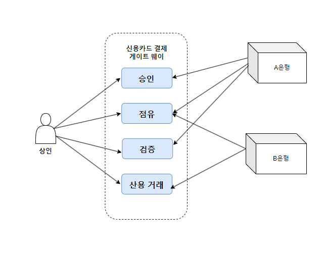

# 1. 비즈니스 도메인이란?

비즈니스 도메인은 기업의 주요 활동 영역을 정의한다. 쉽게 말해 기업이 제공하는 서비스를 비즈니스 도메인이라 칭한다. 예를 들어, 아마존은 클라우드 서비스를 제공하고 스타벅스는 배송 서비스를 제공한다.

비즈니스 도메인은 여러 개 가질 수 있다. 우버는 차량 도메인을 운영하면서 음식 배달 서비스도 제공한다.

또 비즈니스 도메인은 자주 변경할 수 있다.

# 하위 도메인이란?

비즈니스 도메인의 목표를 달성하기 위해 기업은 여러 가지 하위 도메인을 운영해야 한다. 하위 도메인은 비즈니스 활동의 세분화된 영역이다. 단순히 하나의 하위 도메인을 가지고는 수익을 낼 수 없다. 여러 가지의 하위 도메인들의 상호작용을 통해 기업의 경쟁력과 수익을 기대할 수 있다.

예를 들어, 스타벅스는 커피를 만드는 곳이다. 하지만 커피만 맛있다고 성공할 수 없다. 부동산 위치, 직원과 재정 관리를 동시에 해야 한다.  

회사가 해당 비즈니스 도메인에서 경쟁하려면 이 모든 것이 함께 필요하다.

# 하위 도메인의 유형

하위 도메인은 서로 다른 전략적 비즈니스 가치를 가진다. 도메인 주도 설계에서 하위 도메인은 **핵심**, **일반**, **지원**의 세 가지 유형을 가지는데. 살펴보자.

## 1) **핵심 하위 도메인(core subdomain)**

핵심 하위 도메인이란 다른 기업과 차별화된 발명이나 서비스 혹은 성능을 의미한다. 그 자체로 수익에 영향을 줄 수 있는 도메인이다.

예를 들어, 우버는 새로운 운송 수단인 승차 공유 서비스를 제공했다. 만약 다른 경쟁업체에서 동일한 서비스를 만들면 그에 대응해 핵심 비즈니스를 최적화하고 발전시킬 방법을 찾았다.

- **복잡성**
    
    구현하기 쉬운 핵심 하위 도메인은 일시적으로 경쟁 우위만 제공할 뿐이다. 결국 경쟁사가 따라 잡아 더 좋은 성능을 이끌 수 있을 것이다. 그렇기 때문에 회사 솔루션은 모방하거나 복제하기 어려워야 한다.
    
- **경쟁 우위 원천**
    
    무조건 특정 기술이 있어야 하는 것은 아니다. 그저 특정 기술의 보조된 서비스만 제공해도 된다. 예를 들어, 온라인으로 보석을 판매하는 보석 제조업체라고 해보자. 여기에 핵심은 보석의 디자인이다. 이런 디자인을 온라인으로 따로 기술할 수 없다. 온라인에서는 보석을 판매하고 등록하는 일만 하면 될 것이다.
    

## 2) **일반 하위 도메인(generic subdomain)**

일반 하위 도메인이란, 모든 회사가 같은 방식으로 수행하는 비즈니스 활동을 의미한다. 핵심 하위 도메인처럼

일반적이며 복잡하고 구현하기 어렵다. 하지만 이미 많은 부분이 보완되고 수정되어 있기 때문에 더 이상의 최적화나 혁신은 필요 없다.

예를 들어, 대부분의 시스템은 사용자를 인증하고 권한을 부여하는데. 이에 대한 매커니즘이나 알고리즘은 검증된 것들이 많이 있다. 굳이 새로운 것을 만들 필요없이 검증된 솔루션을 사용하면 된다. 

## 3) 지원 하위 도메인(supporting subdomain)

이름에서 알 수 있듯이 지원 하위 도메인은 회사의 비즈니스를 지원하는 역할을 한다. 복잡도는 상대적으로 낮으며 단순하 CRUD 인터페이스를 말한다. 

# 하위 도메인 비교

## 1) 경쟁 우위(핵심 > 일반 = 지원)

유일하게 핵심 하위 도메인말이 회사에 경쟁 우위를 제공한다. 핵심 하위 도메인은 경쟁사와 차별화하기 위한 회사의 전략이다. 

일반 하위 도메인은 경쟁사와 동일하게 일반적인 솔루션을 사용해도 상관 없다. 

지원 하위 도메인도 비슷하다. 경쟁력에 아무런 영향을 주지 않기 때문에 일반적인 솔루션을 사용해도 된다. 

## 2) 복잡성(핵심 > 일반> 지원)

하위 도메인은 복잡도별로 유형이 달라진다. 복잡도에 따라 복잡도를 수용할 수 있는 도구와 기술이 달라지기 때문에 하위 도메인을 식별하는 작업은 이루어져야 한다.

지원 하위 도메인의 복잡도는 낮다. 간단한 ETL 작업이나 CRUD 작업이 이 도메인에 해당한다. 

일반 하위 도메인의 복잡도는 좀 더 높다. 예를 들어, 암호화 알고리즘이나 인증 메커니즘을 들 수 있다. 이미 많은 사람들의 테스트와 검증이 이루어졌기 때문에 새로운 것을 만드는 것보다는 있는 것을 사용하는 것이 낫다.

핵심 하위 도메인의 복잡도는 높다. 이유는 다른 업체에서 모방하기 어려워야 하기 때문이다. 경쟁력은 수익에 영향을 주기 때문에 복잡해야 한다.

핵심과 지원 하위 도메인의 구분하기 위한 방법으로는 수익 창출 여부와 단순, 복잡 여부로 들 수 있다. 

## 3) 변동성(핵심 > 일반 > 지원)

핵심 하위 도메인은 자주 변동될 수 있다. 이유는 단순하지 않고 복잡하기 때문이다. 또 회사의 경쟁 우위를 위해서는 지속적인 혁신과 발전을 필요하다.

그렇기 때문에 잦은 수정이 이루어진다. 

일반 하위 도메인의 경우, 버그 발견이나 보안 패치등에 따라 수정이 이루어지거나 아예 솔루션이 변경 될 수 있다. 

지원 하위 도메인은 자주 변경되지 않는다. 기업에 어떠한 경쟁 우위를 제공하지 않기 때문이다.

# 하위 도메인 경계 식별

하위 도메인을 식별하면 두 가지 장점을 가진다. 설계 프로세스를 간소화 할 수 있고 설계 의사 결정에 상당한 도움을 준다. 하위 도메인에 대한 식별하는 방법이 중요한데. 그러면 어떻게 식별해야 할까? 

하위 도메인의 유형은 기업의 **비즈니스 전략**에 따라 정의된다. 기업의 우선 순위 목표나 경쟁 우위 요소가 될 수 있다. 먼저 회사의 부서와 기타 조직 단위로 출발하는 것이 좋다. 

예를 들어, 쇼핑몰이라고 해보자. 창고, 고객 서비스, 출고, 배송, 품질 관리 등 다양한 부서들이 있을 것이다. 이렇게 큰 단위로 하위 도메인을 분류해보자. 

그 다음부터는 세부 사항으로 들어가서 다시 한 번 하위 도메인을 정제 해야 하는데. 여기서 고객 서비스는 일반 하위 도메인이라고 볼 수 있다. 이 고객 서비스를 세분화 해보면 헬프 데스크 시스템, 전화 시스템, 교대 근무 관리 및 일정으로 나눌 수 있다. 

**헬프 데스크과** **전화 시스템은** **일반 하위 도메인**이고 **교대 근무 관리는 지원 하위 도메인**이다. 여기서 회사에서는 과거에 성공한 상담 사례에 대해 처리했던 상담원에게 자동으로 연결해주는 알고리즘을 개발할 수 있다. 그러면 **상담 사례 라우팅이라는 핵심 하위 도메인**이 생기게 된다.

그러면 언제까지 하위 도메인의 정제를 해야 할까? 

신용 카드 결제 게이트웨이의 유스케이스 다이어그램이다. 

- **유스케이스 용어**
    - **시스템 (System)**: 만들고자 하는 프로그램으로, 사각형의 모양으로 유스케이스를 감싼다.
    - **액터 (Actor)**: 시스템의 외부에 있고, 시스템과 상호작용을 하는 사람이나 시스템으로, 졸라맨 (?) 모양으로 표시한다. 액터 명은 위나 아래에 표시하여 액터의 역할을 작성해야한다.
    - **유스케이스 (Usecase)**: 사용자 입장에서 바라본 시스템의 기능으로, 시스템이 액터에게 제공해야 하는 기능으로 요구사항을 나타낸다. 타원으로 표시한다. 유스케이스는 (~한다)와 같이 표시해야한다.
    - **관계 (Relation)**: 액터와 유스케이스 사이의 관계를 나타낸다. 종류는 연관 (Association), 의존 (Dependency), 일반화 (Generalization)이 있다. 그 중 의존 관계는 포함 (Include), 확장 (Extend)로 나뉘어진다.

유스케이스 별로 하나의 하위 도메인 경계로 만든 예시이다. 이렇게 응집된 유스케이스의 집합을 하위 도메인으로 만들 수 있다. 

그러면 하위 도메인의 경계를 식별하기 위해 온 신경을 곤두세워야 할까? **핵심 하위 도메인**은 반드시 그렇게 해야한다. 가장 **중요**하며 **변동성**이 있고 **복잡**하기 때문이다.

일반 하위 도메인과 지원 하위 도메인의 정제 작업은 핵심 하위 도메인처럼 할 필요가 없다. 만약 어떤 특정한 하위 도메인을 세부적으로 정제하는 과정에서 나오는 유형이 모두 동일하다면 더 이상 정제할 필요가 없다. 

### 도메인 분석 예제

**Gigmaster**는 티켓 판매 및 유통 회사다. 모바일 앱은 사용자의 음악 라이브러리, 스트리밍 서비스 계정, 소셜 미디어 프로필을 분석하여 사용자가 관심을 가질 만한 주변의 공연 정보를 찾아낸다.

Gigmaster의 사용자는 자신의 개인 정보에 민감하다. 따라서 모든 사용자의 개인정보는 암호화된다. 또한 어떤 상황에서도 사용자의 죄책감이 새어 나오지 않도록 회사의 추천 알고리즘은 익명 데이터만 사용한다.

앱의 추천 기능을 개선하기 위해 새로운 모듈이 구현되었다. Gigmaster를 통해 구매하지 않더라도 사용자가 과거에 참석한 공연 정보를 기록할 수 있다.

**비즈니스 도메인과 하위 도메인**

Gigmaster의 **비즈니스 도메인은 티켓 판매**이다. 이것이 고객에게 제공되는 서비스이다.

**핵심 하위 도메인**

Gigmaster의 주요 경쟁 우위는 추천 엔진이다. 또한 사용자의 개인정보를 중요하게 생각하며 익명 데이터에 대해서만 처리한다. 명시적으로 언급되지는 않았지만 모바일 앱의 사용자 경험도 중요하다고 추론할 수 있다. 따라서 Gigmaster의 핵심 하위 도메인은 다음과 같다. 

- 추천 엔진
- 데이터 익명화
- 모바일 앱

**일반 하위 도메인**

- 암호화 : 모든 데이터 암호화
- 회계 : 회사가 영업을 하고 있기 때문
- 정산 : 고객에게 청구
- 인증 및 권한 부여 : 사용자 식별

**지원 하위 도메인**

- 음악 스트리밍 서비스와 연동
- 소셜 네트워크와 연동
- 참석 공연 모듈

---

# 2. 도메인 지식 찾아내기

<aside>
💡 운영환경에 배포되는 것은 도메인 전문가의 지식 아니라 개발자의 이해 혹은 오해다.
                                                                                                    - 알베르토 브랜돌리니(Alberto Brandolini)

</aside>

효과적인 소프트웨어 솔루션을 설계하려면 적어도 기본적인 비즈니스 도메인 지식이 필요하다. 하지만 이러한 지식은 도메인 전문가의 몫이다. 소프트웨어 엔지니어는 이러한 전문가가 될 필요도 될 수가 없다. 

다만 소프트웨어 엔지니어의 역할은 도메인 전문가의 비즈니스 용어와 생각 즉, **멘탈 모델을 모방**해야 하는 것이다.

**비즈니스 문제와 요구사항의 이면에 대한 도메인 전문가의 이유와 생각에 대해서 이해하지 못한다면** 단순히 요구사항을 번역한 것에 불과하다. 

멘탈 모델을 모방하기 위해서는 소프트웨어 엔지니어와 도메인 전문가의 커뮤니케이션은 반드시 필요하다. 이런 효과적인 커뮤니케이션을 위해 사용되는 것이 **유비쿼터스 언어**이다.

## 유니쿼터스 언어란 무엇인가?

**유비쿼터스 언어를 사용하는 것은 도메인 주소 설계의 초석**이다. 프로젝트와 관련된 모든 이해관계자들은 비즈니스 도메인을 설명할 때 같은 언어인 유비쿼터스 언어를 사용한다. 가장 중요한 요점은 **도메인 전문가에 초점**을 맞추고 도메인 전문가가 사용하기에 편해야 한다.