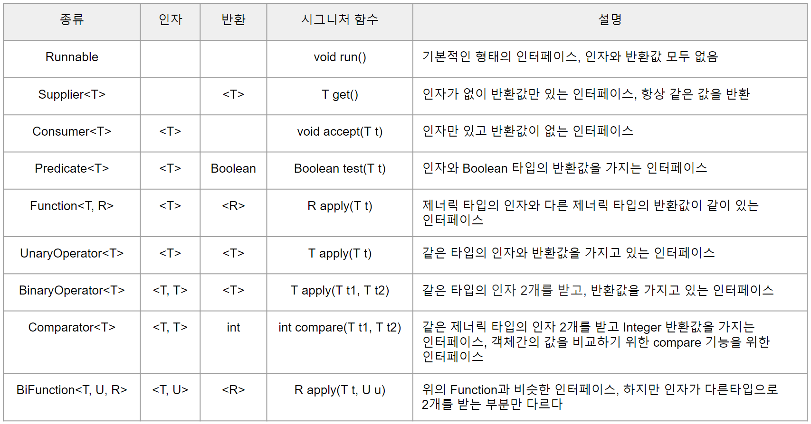

# 1. 람다란?

가장 먼저 람다란 무엇이고 어디서 나온 말이며 중요한 키워드가 무엇인지 설명하고자 한다.

## 1) 람다란 무엇인가?

람다(lamda)라는 용어는 **미적분학** 학계에서 개발한 시스템에서 유래한다. 

람다가 있기 전 자바에서는 익명 함수가 존재했다. 익명 함수란 이름 그대로 이름 없는 함수이며 사용할 때 바로 구현해서 사용되는 함수이다. 

람다 표현식은 이 **익명 함수를 단순화한 것**이다. 익명 함수를 인스턴스화한 표현식이며 클래스에 종속되지 않는 함수로써 **인수**, **반환 값** 등 역할을 할 수 있다. 예외 또한 가질 수 있다. 

그러면 왜 람다 표현식이 중요할까? 그 이유는 **동작 파라미터화 패턴**에 있다. 동작을 파라미터화 할 경우, 람다 표현식을 쓰면 아주 유용하기 때문이다. 동작 파라미터화 패턴은 본 내용과 다른 내용이기 때문에 다루지 않는다. 

- **람다 기본 구성**
    
    ```java
    (Apple a1, Apple a2) -> a1.getWeight().compareTo(a2.getWeight());
       람다 파라미터     화살표          람다 바디
    ```
    

# 2. 함수형 인터페이스

람다를 이해하려면 이와 연동되는 **함수형 인터페이스**를 잘 알고 있어야 한다. 아래의 코드는 함수형 인터페이스의 한 예인 Predicate<T> 이다.  

```java
public interface Predicate<T>{
	boolean test(T t);
}
```

함수형 인터페이스란 하나의 추상 메서드를 가지고 있는 인터페이스이다. 무조건 **하나의 추상 메서드**를 가지고 있어야 하지만 **디폴트 메서드**의 경우, 여러 개 가질 수 있다.  

람다 표현식으로 함수형 인터페이스의 구현을 직접 전달할 수 있다. 쉽게 말해 람다 표현식으로 추상 메서드의 구현체를 바로 만들어서 사용할 수 있다는 것이다. 이로인해 깔끔한 코드 구현이 가능해진다. 

- **종류**



https://joomn11.tistory.com/22?category=854732

# 3. 람다를 어떻게 함수형 인터페이스와 연결하는가?

## 1) 함수 디스크립터

함수 디스크립터를 설명하기 앞서 추상 메서드의 **시그니처(signature)**를 알아야 한다. 위에 작성한 Predicate<T> 의 추상 메서드인 test() 의 시그니처를 살펴보자. 

`( T t ) → boolean`

T 타입의 매개 변수를 받아 boolean 타입을 반환한다는 뜻이다. 함수형 인터페이스는 모두 이러한 시그니처를 가진다. 

그리고 test() 와 같이 그 시그니처를 서술하는 메서드를 **함수 디스크립터(function desctriptor)** 라고 부른다. 

그러면 람다 표현식의 형식을 어떻게 검사를 할까? 바로 **형식 검사**, **형식 추론**, **제약**을 통해 **컴파일러가 람다 표현식의 유효성**을 확인한다. 

## 2) 람다 표현식 유효성 검사

함수 디스크립터를 설명하면서 작성한 것처럼 람다 표현식을 함수형 인터페이스와 매칭하고 유효성을 검사하는 방법에 대해서 설명한다. 

- **형식(type) 검사**
    
    람다가 직접 사용되는 **영역(context)**를 이용해서 **람다의 형식(type)**을 추론할 수 있다. 그리고 해당 영역에 실제 들어와야 할 람다 표현식의 타입(type) 을 **대상 형식(target type)** 이라고 부르는데. 이들을 통해 검사가 이루어진다. 
    
    예를 들어보자. 
    
    ```java
    (대상 형식)
    public filter(List<Apple> inventory, Predicate<Apple> p){
    	...
    }
    ```
    
    선언된 함수형 인터페이스를 통해 대상 형식을 유추할 수 있고 
    
    ```java
   ( 영역    (람다 형식)    )
    filter(inventory, ( Apple a ) -> a.getWeight() > 150);  
    ```
    
    실제 사용된 **영역**과 **람다 형식**을 통해 대상 형식을 추론 할 수 있다. 
    
    순서는 다음과 같다. 
    
    1. **람다가 사용된 영역은 무엇인가?**
    2. **대상 형식을 살펴본다 `(Predicate<Apple> p)`**
    3. **대상 형식의 추상 메서드는 무엇인가(시그니처)? `boolean test(Apple apple)` = `Apple → boolean`**
    4.  **컴파일러는 함수 디스크립터와 람다 형식을 비교하여 일치하는지 확인한다. 일치하면 형식 검사가 성공적으로 완료된다.**  

## 3)  형식 추론과 제약

형식 추론은 간단하다. 대상 형식을 통해서 람다 표현식과 관련된 함수형 인터페이스를 추론할 수 있기 때문에 사용되는 타입 또한 추론이 가능하다. 그러므로 람다식에서 파라미터 형식을 생략할 수 있다. 

```java
Comparator<Apple> c = (Apple a1, Apple a2) -> a1.getWeight().compareTo(a2.getWeight());
Comparator<Apple> c = (a1, a2) -> a1.getWeight().compareTo(a2.getWeight()); // Apple 생략
```

람다 표현식에서는 **제약**이 있는데. 표현식 내부 변수가 아닌 외부 지역 변수를 사용할 때, 해당 **지역 변수가 final**이어야 한다는 것이다. 

이 말인즉 변수의 값이 변하면 안된다는 것이다. 그 이유는 지역 변수는 스택에 저장되어 있기 때문이다. 

만약 람다가 다른 스레드에 사용된다면 스택에 저장된 지역 변수를 가져다 쓰려고 하는데. 기존 지역변수의 스레드가 사라져 버린다면 람다가 실행된 스레드에서 접근할 때 문제가 생길 수 있다. 

그래서 람다는 변수를 사용할 때 복사본을 가져다가 쓰며 바뀌지 않기 위해 final로 된 것만 사용해야 한다는 제약이 생겼다. 

## 4) 간단한 활용(실행 어라운드 패턴)

람다와 동작 파라미터화를 통해 어떻게 간결한 코드를 구현할 수 있는지 예제를 살펴보자. 

다음의 예제는 파일을 열고 파일의 한 행을 읽는 코드이다. 여기서 파라미터화할 동작은 **읽는 부분**이다. 한 행만 읽을 수 있고 두 행, 혹은 모든 줄을 읽을 수 있도록 확장할 수 있게 하려 한다. 

다른 부분인 파일을 열거나 닫는 부분은 항상 동일하기 때문에 유지하고 인수로 전달할 람다식으로 동작만 변화를 준다. 

1. **이전 코드**

```java
public String processFile() throw IOException {
	try( BufferedReader br = 
				new BufferedReader(new FileReader("data.txt"))) {
			return br.readLine(); **<-- 파라미터화 할 위치**	
	}
}
```

1. **함수형 인터페이스 생성**
    
     컴파일러에게 알리기 위해 **@FunctionalInterface** 애너테이션을 포함하자. 
    
    ```java
    @FunctionalInterface
    public interface BufferedReaderProcessor {
    	String process(BufferedReader b) throws IOException;
    }
    ```
    
2. **만든 함수형 인터페이스를 인수로 선언**
    
    ```java
    public String processFile(BufferedReaderProcessor p) throws IOException{
    	...
    }
    ```
    
3. **함수형 인터페이스를 사용한 내부 구현 변경**
    
    ```java
    public String processFile(BufferedReaderProcessor p) throws IOException{
    	try(BufferedReader br = 
    					new BufferedReader(new FileReader("data.txt"))){
    			return p.process(br);
    	}
    }
    ```
    
4. **사용**
    
    ```java
    // 한 줄 읽기
    String oneLine = processFile( br -> br.readLine());
    
    // 두 줄 읽기 
    String twoLine = processFile( br -> br.readLine() + br.readLine());
    ```
    

# 4. 활용

람다식을 사용하는 이유는 간결한 코드를 위해서이다. 그런데 이런 간결한 코드를 위해 자바의 람다식에서는 **메서드 참조**라는 것을 제공해준다. 

다음은 람다식을 사용한 기존 코드이다. 

```java
inventory.sort((Apple a1, Apple a2) -> 
									a1.getWeight().compareTo(a2.getWeight()));
```

이를 메서드 참조를 사용하면

```java
inventory.sort(comparing(Apple:getWeight));
```

의미하는 바를 좀 더 명확하게 이해할 수 있는 코드로 바뀐다. (**가독성** ▲)

## 1) 메서드 참조 가능한 유형

1. **정적 메서드 참조**
    
    예를 들어 Integer의 parseInt 메서드를 `Integer::parseInt`로 표현이 가능하다. 
    
2. **인스턴스 메서드 참조**
    
    String의 내부 메서드인 length도 사용이 가능하다. `String::length`
    
3. **기존 객체의 인스턴스 메서드 참조**
    
    인스턴스를 만들고 만들어진 변수를 사용해서 바로 사용이 가능하다. 
    
    ```java
    String test = new String("test");
    System.out.println(test::length);
    ```
    
4. **생성자 참조**
    
    생성자 참조도 간단하다. `Apple::new` 와 같이 사용이 가능한다. 이 시그니처는 **단순히 빈 생성자만을 의미하지 않는다**. 
    
    만약 생성자가 만들어져 있다면 아래의 모든 함수형 인터페이스가 가능하다.
    
    ```java
    Supplier<Apple> c1 = Apple::new;
    Function<Integer, Apple> c2 = Apple::new;   // public Apple(Integer num) 
    																						// 와 같은 생성자가 존재해야 함
    ```
    

## 2) 함수형 인터페이스의 조합

Comparator, Function, Predicate 같은 함수형 인터페이스는 람다 표현식을 조합할 수 있도록 도움이 되는 **디폴트 메서드**들이 구현되어 있다. 이 디폴트 메서드를 사용하면 좀 더 풍부한 연산이 가능해진다.