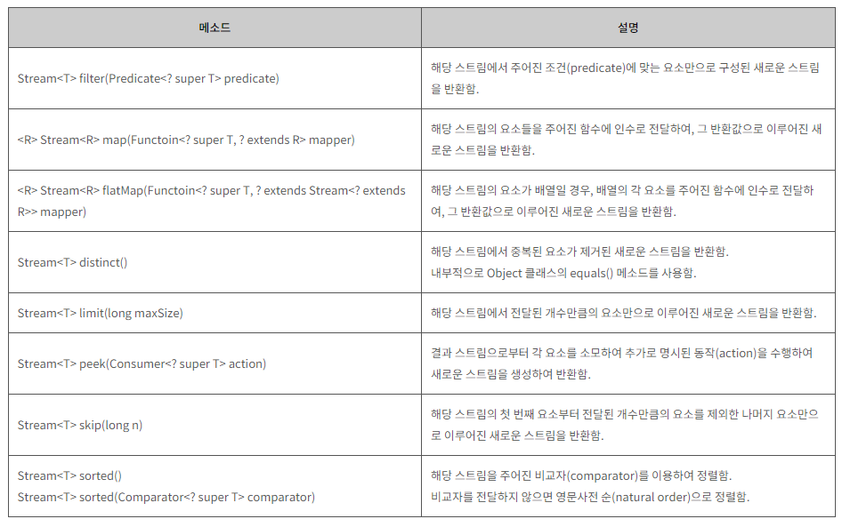

# 1. 스트림이란 무엇인가?

자바에서는 **컬랙션**을 통해서 많은 데이터를 한 번에 그룹화하고 이를 처리할 수 있게 해준다. 이때 **스트림**을 사용하면 좀 더 풍부한 연산이 가능하다. 스트림은 ‘데이터 처리 연산을 지원하도록 소스에서 추출된 연속된 요소’ 로 정의할 수 있다. 

스트림의 주요 특징은 **선언형**, **병렬**, **유연성**이 있다. 

## 1. 선언형

먼저 **선언형**에 대해 알아보자. 흔히 SQL 질의문을 짤 때, **dishes** 라는 테이블의 **calorie**가 400 이상인 데이터를 수집하고자 할 때 선언문은 아래와 같다. 

`SELETE name FROM dishes WHERE calorie > 400;`

SQL 질의문을 보면 그 의미하는 바가 명확하다. *‘SELECT 한다. disches 테이블에서 calores가 400보다 작은 것들을’,*  단순히 선언만 하면 DB에서 내부 연산이 실행되고 알아서 데이터들이 수집된다. 

자바에서는 스트림을 사용해서 **선언만으로 데이터들의 연산이 가능해진다.** 연산은 내부 라이브러리에서 최적화되어 실행된다. 

```java
List<String> lowCaloricDishedName = 
								menu.stream() // stream의 시작
										.filter(d -> d.getCalories() > 400)  // 칼로리가 400보다 큰 것
										.sorted(comparing(Dish::getCalories)) // Calorie 로 정렬
										.map(Dish::getName)  // 이름으로 데이터 추출
										.collect(toList());  // 데이터들을 List에 저장
```

## 2. 병렬성

여기서 **병렬성**을 추가하려면 **parallelStream()**을 추가하면 된다. 그러면 멀티코어 아키텍처에서 병렬로 실행된다. 병렬에 대해선 다른 장에서 설명한다. 이와 같은 병렬화을 통해 성능은 향상된다. 

```java
List<String> lowCaloricDishedName = 
								menu.**parallelStream()** // 병렬 stream의 시작
										.filter(d -> d.getCalories() > 400) 
										.sorted(comparing(Dish::getCalories)) 
										.map(Dish::getName)  
										.collect(toList());  
```

## 3. 유연성

마지막으로 **유연성**을 살펴보자. 스트림을 사용시 그 구조를 구분하면 **생성, 중간 연산, 종료 연산**으로 나눌 수 있다.  

컬랙션에서 Stream() 생성을 통해 스트림을 만들 수 있고 중간 연산을 이용해서 스트림파이프 라인을 형성한다. **(유연성)**

이때 중간 연산까지는 연산이 이루어지지 않는다.(**Lazy**)  마지막으로 종료 연산을 사용하면 더 이상 연결할 수 없고 연산이 시작되고 결과가 나오게 된다. 

예를 들어, 

**menu.stream() → filter → sorted → map → collect**

menu.stream() 은 **생성**, filter, sorted, map 은 **중간 연산**, collect는 **종료 연산**이 된다. 중간 연산은 중복으로 생성하거나 여러 개를 붙여서 연결이 가능하다.

**대표적인 중간 연산**



http://www.tcpschool.com/java/java_stream_intermediate

                                                                                                                                                                                                                                                                                                                                                                                                                                                                                                                                                                                                                                                                                                                                                                                                                                                                                                                                                                                                                                                                                      

# 2. 스트림과 컬렉션

스트림을 시작하기 앞서 **스트림**과 **컬렉션**의 차이를 알아보자. 스트림과 컬렉션의 차이는 무엇일까?

둘 모두 **연속된 요소의 형식의 값을 저장하는 자료구조**의 인터페이스를 제공한다. 쉽게 말해 연달아 있는 데이터들이 저장되어 있는 인터페이스인데. 이 연속된(연달아)의 의미는 **순차적으로 데이터를 접근**한다는 뜻이다.

그렇담 동일하게 데이터가 저장되어 있는데. 어느 부분에서 차이가 있을까?

한 가지 예시를 들어보자. 영화 아바타를 보는 방법 중 DVD와 인터넷 스트리밍가 있다고 해보자. DVD 내부에 아바타의 전체 자료구조가 저장되어 있으므로 **DVD는 컬렉션**이다.

DVD가 아니라 인터넷으로 구매하여 스트리밍으로 볼 때는 사용자가 시청하는 부분의 몇 프레임을 부분 부분 미리 내려받고 시청한다. 그러면 스트림의 남은 **대부분의 프레임을 받지 못한 상태**에서 미리 내려 받은 프레임부터 재생할 수 있다. **스트티밍은** **스트림**과 같다.

바로 **데이터를 언제 계산**하느냐가 컬랙션과 스트림의 차이이다. **컬렉션은 모든 값을 미리 계산하여 메모리에 저장하는 자료구조**이다. 반면 **스트림은 요청할 때에 요소를 계산**한다. 

스트림의 이러한 구조가 가능한 이유는 요청이 올 때만 계산하는 **게으른 생성**이라는 특성 때문이다. 

## 1. 단 한번의 탐색

스트림의 주요 특징 중 하나는 한 번만 탐색할 수 있다. 한 번 탐색하면 그 스트림은 다시 사용할 수 없다. 다시 사용하고 싶다면 새로운 스트림을 제공 받아야 한다.

```java
List<String> titles = Arrays.asList("first", "second", "third");
Stream<String> s = title.stream();
s.forEach(System.out::println);    O  // 모든 단어 출력 
**s.forEach(System.out::pritnln);**    X  // IllegalStateException 발생
```

## 2. 외부 반복과 내부 반복

컬렉션에서 반복문을 사용하려면 for-each를 사용하던 iterator 를 사용하던 **사용자가 직접** 요소를 반복을 처리해야 한다. 이를 **외부 반복**이라고 한다.

반면 스트림은 단순히 선언만 해주면 내부적으로 알아서 반복이 처리된다. **(내부 반복)**

이 두 부분이 정확히 어떤 부분이 차이가 있을까?

### 1) 외부 반복

```java
List<Striing> names = new ArrayList<>();
Iterator<String> iterator = menu.iterator();
while(iterator.hasNext()) {             // 다음 값이 있으면
	Dish dish = iterator.next();          // 가져오고
	names.add(dish.getName();             // names에 넣는다.
}
```

개발자는 ‘컬렉션에서 다음 값이 있으면 가져오고 새로운 리스트에 넣어준다.’ 라는 형식으로 구현한다.

### 2) 내부 반복

```java
List<String> names = menu.stream()
											.map(Dish::getName)
											.collect(toList());
```

코드가 훨씬 깔끔하다는 장점과 단순히 ‘데이터들의 이름을 가져와서 List로 만들어라.’ 라는 선언만으로 이름만 담긴 리스트를 얻을 수 있다. 실제 내부적으로 반복문은 알아서 처리하게 된다. 

외부 반복과 내부 반복의 예시를 통해서 차이를 확인할 수 있을 것이다. 내부 반복이 더 좋은 이유는 두 가지가 더 있다. 만약 다른 조건으로 바꾸고 싶거나 필터를 넣고 싶다면 외부 반복은 내부 구조부터 뜯어 고쳐야 하고 고친 코드가 범용적(재사용성)인지도 모른다. 아니면 새로 계속 만들어야 한다. 

반면 내부 반복은 단순히 선언문(중간 연산)을 추가하는 것만으로 이러한 처리가 끝나게 된다.(높은 추상화)

또 병렬 처리의 이점이다. 외부 반복은 벙렬 처리하기 위해서는 모든 관리를 스스로 해야 한다. synchronized를 사용하던 어떻게 하던 그 처리가 쉽지가 않다.

내부 반복은 병렬성을 내부적으로 알아서 처리하기 때문에 그 과정을 개발자가 신경 쓰지 않아도 된다.