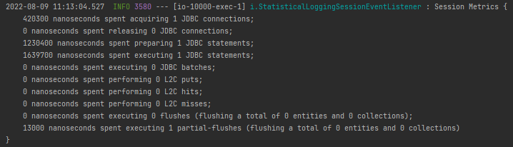
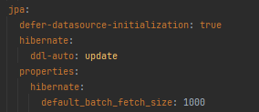

많은 사람들이 생각하는 **Hibernate**에 대해 가지는 오해중 하나는 데이터베이스가 크거나 사용자가 많아지면 성능 문제가 발생한다고 생각합니다. 하지만 대부분 잘 만들어진 프로젝트를 보면 HIbernate를 사용하여 확장성이 뛰어나고 유지 보수가 쉬운 영속성 계층을 구현한 것을 볼 수 있습니다. 

그러면 이러한 **잘만들어진 프로젝트**와 달리 **성능 문제를 낳는 프로젝트**의 문제는 무엇일까요?

크게 두 가지를 꼽을 수 있습니다. 

1. **개발 중 로그 메시지를 출력하지 않거나 잘못된 메시지를 출력하여 잠재적 이슈 문제를 찾을 수 없게 합니다.** 
2.  **Hibernate 기능을 잘못 사용하여 추가 SQL 문이 발생하고 결국 이러한 문제가 프로덕션으로 빠르게 퍼지게 됩니다.**

그러면 바로 이를 예방하고 관리하는 과정을 살펴보겠습니다 .

### 1. 개발 과정에서 성능 이슈를 찾아라!

애플리케이션을 실제 프로덕션 환경에 **배포하기 전에 성능 문제를 찾는 것이 베스트**입니다. 하지만 이는 말처럼 쉽지 않습니다.  왜냐하면 대부분의 성능 이슈들은 작은 테스트 환경에서는 찾기 어렵기 때문입니다. 

작은 테스트 환경에서는 성능에 아무런 문제가 발생하지 않습니다. 하지만 점차 데이터베이스의 크기가 커지고 사용자가 많아지는 프로덕션 환경으로 바뀌면 내부에 잠재된 확장에 대한 **비효율성**에 의해 바로 문제가 발생하게 됩니다. 

그러면 **비효율성**을 확인하려면 어떡해야 할까요?

**Hibernate**에서는 **각** **세션별 내부 통계**를 확인할 수 있도록 출력해주는 기능이 있습니다. **Spring Data JPA** 를 사용한다면 아래와 같이 설정하면 됩니다.  **(단, 개발환경에서만 사용합시다. )**

```yaml
spring.jpa.properties.hibernate.generate_statistics=true
logging.level.org.hibernate.stat=DEBUG
```

이제 실행된 각 쿼리에 대해 **실행된 JDBC 수, 2차 캐시, flush 수** 등이 아래와 같이 출력해줍니다. 



이를 확인하면 **느린 쿼리, 너무 많은 쿼리, 잘못된 캐시 사용**을 정기적으로 찾을 수 있게 됩니다. 

추가적으로 다음과 같이 느린 쿼리에 대한 임계점을 설정 할 수 있습니다.

```yaml
spring.jpa.properties.hibernate.session.events.log.LOG_QUERIES_SLOWER_THAN_MS=10
```

임계값을 **10ms** 으로 설정하여 이보다 오래 걸릴 경우, log에 아래와 같이 출력해줍니다. 

```yaml
12:23:20,545 INFO  [org.hibernate.SQL_SLOW] - SlowQuery: 6 milliseconds. SQL:
												 'select a1_0.id,a1_0.firstName,a1_0.lastName,a1_0.version from Author a1_0'
```

### 2. 느린 쿼리 개선

앞서 말한 방식으로 이제 느린 쿼리를 정기적으로 찾을 수 있게 됐습니다. 이제 발견한 쿼리를 개선해야 하는데. 각 데이터베이스는 이를 해결하기 위한 여러가지 기능을 제공합니다. 하지만 JPQL 또는 Criterial API는 이를 지원하지 않습니다.

이럴땐 **네이티브 쿼리**를 작성하면 됩니다. 

```java
Author a = (Author) em.createNativeQuery("SELECT * FROM Author a WHERE a.id = 1", Author.class)
																																								.getSingleResult();
```

Hibernate는 네이티브 쿼리를 분석하지 않습니다. 이로인해 특정 데이터베이스에 적절한 쿼리를 작성할 수 있게 됩니다. 다만 너무 한 데이터베이스에 종속적으로 작성한다면 의존성이 생길 수 있습니다. 

**JPQL 쿼리**는 반환값으로 Object[] 을 받습니다. 만약 쿼리의 결과를 Entity에 받고 싶다면 두 번째 매개변수로 넣어주면 됩니다. 그러면 Hibernate는 쿼리 결과를 엔티티에 자동으로 매핑해줍니다. 

엔티티가 아닌 다른 데이터로 매핑하고 싶다면 JPA에서 제공하는 **@SqlResultSetMapping** 를 사용하면 됩니다. 

관련 링크 : https://thorben-janssen.com/result-set-mapping-basics/

### 3. 필요 없는 쿼리를 피하라! - FetchType

JPA를 공부하다보면 FetchType을 무조건 **LAZY**로 설정하라고 권장합니다. 그 이유는 **Eager** 를 사용하면 필요없는 쿼리를 모두 가져오기 때문입니다. 

Hibernate의 통계를 활성화하면서 일반적으로 발견하게될 문제는 불필요한 쿼리 실행입니다. 보통 FetchType을 Eager로 사용할 때 발생하는데. 

그러니 ‘**@~ToOne'** 으로 끝나는 연관관계는 모두 **LAZY**로 설정합시다.

```java
@ManyToOne(fetch=FetchType.LAZY)
```

‘**@~ToMany**’ 같은 경우, **default** 로 LAZY 로 설정되어 있어서 따로 설정하지 않아도 괜찮습니다. 

### 4. FetchType.LAZY 설정 후

비즈니스 로직에 모두 **FetchType.LAZY**를 설정해야 하는 것을 알았습니다. 이제 로직에 필요한 쿼리만 발생시킬 수 있습니다. 하지만 이렇게만 설정해두면 또 다른 성능 문제인 **N+1 문제**가 발생할 수 있습니다.

**N+1 문제**란, 한번의 쿼리로 그와 연관된 쿼리가 N개 발생한다는 겁니다. 

예를 들어, 축구팀에 소속된 축구선수를 조회할 때, 축구팀에 대한 Select 문과 연관된 축구선수의 수(N개)만큼 Select문이 발생하게 됩니다.  이를 해결하기 위해 **Fetch Join**을 사용합니다. **단 한번의 쿼리로 모두 가져오게 하는 것이죠**.

- **JOIN FETCH 절 사용**
    
    **JOIN FETCH** 를 사용하면 연관된 두 엔티티를 결합할 뿐아니라 Hibernate에게 연관된 엔티티를 모두 가져오도록 지시합니다. 
    
    ```java
    List<Author> authors = em.createQuery("SELECT a FROM Author a JOIN FETCH a.books b",
    													 Author.class).getResultList();
    ```
    
    추가로 만약 **‘@~ToMany’**의 경우, JOIN FETCT를 하면 하나의 쿼리문이 나가겠지만 중복된 Entity ID로 N개가 찍히게 된다. 이를 JOIN FETCH에 **DISTINCT** 를 넣어줘서 JPA 메모리 상 중복을 제거해줍니다. 
    
    ```java
    List<Author> authors = 
    						em.createQuery("SELECT DISTINCT a FROM Author a JOIN FETCH a.books b", Author.class)
                             .setHint(QueryHints.PASS_DISTINCT_THROUGH, false)
                             .getResultList();
    ```
    

- **페이징 처리**
    
    **‘@~ToOne’**의 경우, 테이블 조인을 해도 데이터의 변동이 없기 때문에 페이징 처리시, **JOIN FETCH** 를 마음껏 사용해도 됩니다. 
    
    **‘@~ToMany’**의 경우, 데이터 수가 변하기 때문에 페이징 + 패치 조인을 동시에 쓰는 것을 지양해야 합니다.  또 동시에 사용하면 한번에 너무나 많은 쿼리 값을 메모리 상에 가져오기 온 뒤에 페이징 처리를 하기 때문에 다음과 같은 **경고**를 발생시킵니다. 
    
    
    
    페이징과 같이 하고 싶다면 JOIN FETCH 를 제거 한 뒤, Entity에 **@BatchSize** 혹은 **default_batch_fetch_size** 를 설정합니다.  그러면 in( ?, ?, ?) 절을 사용하여 설정한 쿼리 수 만큼 한번에 조회합니다. 
    
    간단하게 application.yml에 다음과 같이 설정하면 됩니다. 
    

    

- **in 절**
    
    **findby~** 를 사용해서 return 값으로 **List**로 받는다면 in절을 사용합니다. 이때 데이터가 너무 많다면 in 절을 끊어서 사용하는데. 이 양이 방대하다면 결국 **OutOfMemory** 가 발생합니다.  이를 막기 위해 `hibernate.query.in_clause_parameter_padding=true` 로 항상 true로 둘 것을 권장합니다. 그러면 2의 제곱 단위로 In절의 쿼리를 생성합니다. 
    

### 5. Many-to-Many 는 사용하지 마라

다대다 연관관계는 지양해야 합니다. 그 이유는 Hibernate 는 다대다를 비효율적이게 관리하기 때문이다. List 의 경우, 연관된 새로운 값을 List에 추가하면 기존 값들을 모두 DELETE 하는 쿼리를 발생시킨 뒤 다시 INSERT 쿼리를 하여 새롭게 넣어줍니다. 극한의 비효율입니다.

굳이 다대다 연관관계를 사용한다면 **List**가 아닌 **Set** 을 사용하길 권장합니다. 

### 6. 많은 데이터를 처리한다면 데이터베이스에 위임하자.

비즈니스 로직을 데이터베이스로 이동하기 때문에 좋은 방법이 아닐 수 있습니다. 또 **특정 데이터베이스에 의존하게** 될 수 있습니다. 하지만 특정 데이터베이스에 고정적이라면 데이터베이스가 데이터를 효율적으로 처리하기 때문에 프로시저를 사용하는 것이 보다 나은 선택이 될 수 있습니다. 

데이터베이스의 프로시저를 사용하고 싶다면 Entity에 **@NamedStoredProcedureQuery** 를 사용하면 됩니다. 

```java
@NamedStoredProcedureQuery( 
  name = "getBooks", 
  procedureName = "get_books", 
  resultClasses = Book.class,
  parameters = { @StoredProcedureParameter(mode = ParameterMode.REF_CURSOR, type = void.class) }
)
```

위와 같이 사용하면 아래와 같은 방법으로 사용할 수 있습니다. 

```java
List<Book> books = (List<Book>) em.createNamedStoredProcedureQuery("getBooks").getResultList();
```

### 7. Cache를 사용하라.

대부분의 경우 이전 방법으로 해결이 가능합니다. 하지만 방법을 다 쓰고도 해결이 안된다면 **Cache**를 사용해야 합니다. **변경이 거의 되지 않고 자주 읽히는 데이터라면 Redis 같은 캐시를 사용하는 것이 아주 좋은 방법**입니다. 

Hibernate는 3 가지 캐시를 가집니다. **1 Level Cache, 2 Level Cache, Query Cache** 인데.

 **1 Level Cache**는 Hibernate Session에 사용하는 모든 Entity를 관리합니다. 

 **2 Level Cache**는 Hibernate Session에서 독립적이며 엔티티를 저장합니다. 사용하려면 Entity 클래스 위에 **@Cacheable** 애너테이션을 추가해주면 됩니다. 그러면 Hibernate는 해당 엔티티를 호출할 때 **2 Level Cache**에 저장하고 추가로 탐색을 할 때 SQL 문을 생성하기 전에 Cache를 확인합니다. **(단, JPQL, Criteria, Native Query 는 2 Level Cache를 사용하지 않습니다. )**

추가로 application.properties 에 다음과 같이 설정하거나 **@EnableCaching**을 추가합니다. 

```yaml
spring.jpa.properties.javax.persistence.sharedCache.mode
```

 - 연관 관계의 경우, 연관된 클래스에도 @Cacheable을 추가해줘야 합니다.

[권남](https://kwonnam.pe.kr/wiki/java/hibernate/cache)

[](https://www.baeldung.com/hibernate-second-level-cache)

[Hibernate Performance Tuning Tips - 2022 Edition](https://thorben-janssen.com/tips-to-boost-your-hibernate-performance/)