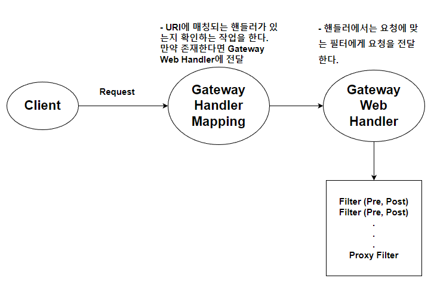
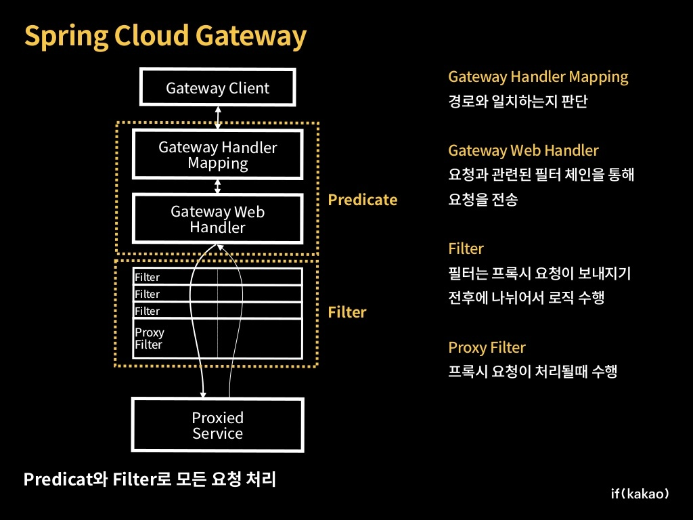
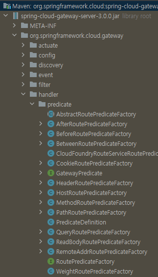

## 개념

**Api Gateway**란, **Clien**t와 **Server** 사이에서 Client에서 받는 요청을 먼저 받아서 처리하고 Server에 전달해주는 **리퍼스 프록시**와 같은 역할이다. 

API Gateway는 **Netty**를 사용하여 구성된다. 그 이유는 Spring MVC 는 동기방식으로 하나의 요청에 하나의 스레드를 생성해서 처리한다. 동기 방식은 만약 많은 요청이 있을 경우, 스레드 부족으로 **성능 하락**이 야기되는데.  

비동기의 경우, 하나의 스레드에 많은 요청을 처리할 수 있다. 이러한 성능상의 이유로 **비동기 WAS**로 구성된 Netty를 사용한다. 

- **사용성**
    - API 라우팅
    - 인증 및 권한 부여
    - 속도 제한
    - 로드 밸런싱
    - 로깅

- **동작방식**
    
    
    
- **내부 구조**
    
    
    
    출처 : [https://velog.io/@tlatldms/서버개발캠프-MSA-아키텍쳐의-API-Gateway-프레임워크-결정](https://velog.io/@tlatldms/%EC%84%9C%EB%B2%84%EA%B0%9C%EB%B0%9C%EC%BA%A0%ED%94%84-MSA-%EC%95%84%ED%82%A4%ED%85%8D%EC%B3%90%EC%9D%98-API-Gateway-%ED%94%84%EB%A0%88%EC%9E%84%EC%9B%8C%ED%81%AC-%EA%B2%B0%EC%A0%95)
    
- **구성 요소**
    
    yaml 파일을 구성할 때, 주요 구성요소는 다음과 같다. 
    
    ```yaml
    spring:
      cloud:
        gateway:
          **routes:**
          - id: add_request_parameter_route
            uri: https://example.org
            **predicates:**
            - Host: {segment}.myhost.org
            **filters:**
            - AddRequestParameter=foo, bar-{segment}
    ```
    
    **1) Route** : id, uri, Predicate 컬렉션, Filter 컬렉션 등의 모음이다. 등록된 정보에 맞는 요청이라면 참으로 본다. 
    
    **2)** **Predicate** : http 요청에 대해 정보의 조건을 확인한다. 예를 들어, 헤더 정보나, 파라미터 정보를 함수형 인터페이스를 사용하여 확인한다. 
    
    **3) Filter** : 특정 팩토리에서 생성되는 **GatewayFilter** 인터페이스이다. request나 response의 값을 전달 전이나 후에 수정할 수 있다. 
    

## 구성

## 구성 방식(간단한 방식, 전체 확장 방식)

- **Shortcut Configuration**
    
    ```yaml
    spring:
      cloud:
        gateway:
          routes:
          - id: after_route
            uri: https://example.org
            predicates:
            - Cookie=mycookie,mycookievalue
    ```
    
    ***{필터 이름 or Predicate}={인자},{인자}*** 로 간단하게 작성할 수 있다. 먼저 **Cookie**는 Spring Cloud에서 구현해 놓은 다양한 **Predicate Factory** 중 하나이다. 
    
    **springframework.cloud.gateway.handler.predicate** 패키지 안에 사용 가능한 Predicate들이 모여있다. 
    
    
    
    **springframework.cloud.gateway.handler.predicate.CookieRoutepredicateFactory**
    
    ```java
    public class CookieRoutePredicateFactory extends AbstractRoutePredicateFactory<Config> {
        public static final String NAME_KEY = "name";
        public static final String REGEXP_KEY = "regexp";
    
        public CookieRoutePredicateFactory() {
            super(Config.class);
        }
    
        public List<String> shortcutFieldOrder() {
            return Arrays.asList("name", "regexp");
        }
    
        public Predicate<ServerWebExchange> apply(final Config config) {
            return new GatewayPredicate() {
                public boolean test(ServerWebExchange exchange) {
                    List<HttpCookie> cookies = (List)exchange.getRequest().getCookies().get(config.name);
                    if (cookies == null) {
                        return false;
                    } else {
                        Iterator var3 = cookies.iterator();
    
                        HttpCookie cookie;
                        do {
                            if (!var3.hasNext()) {
                                return false;
                            }
    
                            cookie = (HttpCookie)var3.next();
                        } while(!cookie.getValue().matches(config.regexp));
    
                        return true;
                    }
                }
    
                public String toString() {
                    return String.format("Cookie: name=%s regexp=%s", config.name, config.regexp);
                }
            };
        }
    
        @Validated
        public static class Config {
            private @NotEmpty String name;
            private @NotEmpty String regexp;
    
            public Config() {
            }
    
            public String getName() {
                return this.name;
            }
    
            public Config setName(String name) {
                this.name = name;
                return this;
            }
    
            public String getRegexp() {
                return this.regexp;
            }
    
            public Config setRegexp(String regexp) {
                this.regexp = regexp;
                return this;
            }
        }
    }
    ```
    
    처음 인자가 **NAME_KEY**에 들어가고 두 번째 인자는 **REGEXP_KEY**에 매칭된다. 
    
    ---
    
- **Fully Expanded Arguments**
    
    ```yaml
    spring:
      cloud:
        gateway:
          routes:
          - id: after_route
            uri: https://example.org
            predicates:
            - name: Cookie
              args:
                name: mycookie
                regexp: mycookievalue
    ```
    
    보통 **name**과 **args**를 사용한다. args는 키와 값을 의미한다. 
    

## Predicates

**Predicate**는 handlerMapping의 역할이다. 조건에 맞는 요청을 해당 서비스에 매칭시켜주는 역할을 한다. 

### 1. 지정 시간 이후에 발생한 요청 매칭(After)

```yaml
spring:
  cloud:
    gateway:
      routes:
      - id: after_route
        uri: https://example.org
        predicates:
        - After=2017-01-20T17:42:47.789-07:00[America/Denver]
```

**After** Predicate는 단 하나 **datetime**(ZoneDateTime) 이란 파라미터를 사용한다. 이 predicates에 지정되면 이 시간 이후에 발생한 모든 요청을 매칭시켜준다. 

### 2. 지정 시간 이전에 발생한 요청 매칭(Before)

```yaml
spring:
  cloud:
    gateway:
      routes:
      - id: before_route
        uri: https://example.org
        predicates:
        - Before=2017-01-20T17:42:47.789-07:00[America/Denver]
```

사용법은 위와 동일하다. 

### 3. 지정 시간 안에 발생한 요청 매칭(Between)

```yaml
spring:
  cloud:
    gateway:
      routes:
      - id: between_route
        uri: https://example.org
        predicates:
        - Between=2017-01-20T17:42:47.789-07:00[America/Denver],
								 2017-01-21T17:42:47.789-07:00[America/Denver]
```

등록한 두 개의 인자 값인 **datetime**을 기준으로 그 사이에 있는 시간에만 매칭시켜준다. 

### 4. 쿠키 값 확인(Cookie)

```yaml
spring:
  cloud:
    gateway:
      routes:
      - id: cookie_route
        uri: https://example.org
        predicates:
        - Cookie=chocolate, ch.p
```

첫 번째 인자인 **chocolate** 는 쿠키 이름을 뜻한다. 두 번째 인자는 정규 표현식을 나타내는데.

chocolate란 이름의 쿠키의 값이 ch.p와 일치하면 요청을 매칭시켜준다. 

### 5. 헤더 값 확인(Header)

```yaml
spring:
  cloud:
    gateway:
      routes:
      - id: header_route
        uri: https://example.org
        predicates:
        - Header=X-Request-Id, \d+
```

쿠키와 마찬가지고 앞 인자가 **헤더 이름**이고 뒤는 **정규 표현식**이다. 

### 6. 호스트명 확인(Host)

```yaml
spring:
  cloud:
    gateway:
      routes:
      - id: host_route
        uri: https://example.org
        predicates:
        - Host=**.somehost.org,**.anotherhost.org
```

인자는 **리스트**이다. 콤마를 기준으로 호스트명을 작성하면 일치하는 요청을 매칭시켜준다. 

 

### 7. HTTP Method(Method)

```yaml
spring:
  cloud:
    gateway:
      routes:
      - id: method_route
        uri: https://example.org
        predicates:
        - Method=GET,POST
```

보면 다 알 수 있다. 

### 8. 경로(Path)

```yaml
spring:
  cloud:
    gateway:
      routes:
      - id: path_route
        uri: https://example.org
        predicates:
        - Path=/red/{segment},/blue/{segment}
```

path가 `/red/1` or `/red/1`/ or `/red/blue` 등일때 매칭시켜준다. 만약 segment 값을 사용하고 싶다면 아래의 코드를 참고

```java
Map<String, String> uriVariables = ServerWebExchangeUtils.getPathPredicateVariables(exchange);

String segment = uriVariables.get("segment");
```

### 9. 쿼리 파라미터(Query)

```yaml
spring:
  cloud:
    gateway:
      routes:
      - id: query_route
        uri: https://example.org
        predicates:
        - Query=green
```

쿼리 파라미터가 ‘green’인 값을 매칭, 이 또한 **인자와 정규표현식으로 사용가능**하다. 

```yaml
spring:
  cloud:
    gateway:
      routes:
      - id: query_route
        uri: https://example.org
        predicates:
        - Query=red, gree.
```

쿼리 이름이 red인 값이 `green` or `greed` 와 같을 때 매칭

### 10. 허용 IP(RemoteAddr)

```yaml
spring:
  cloud:
    gateway:
      routes:
      - id: remoteaddr_route
        uri: https://example.org
        predicates:
        - RemoteAddr=192.168.1.1/24
```

ip와 subnet 을 지정하여 일치하는 IP만 매칭

### 11. 트래픽 비율 분할(Weight)

```yaml
spring:
  cloud:
    gateway:
      routes:
      - id: weight_high
        uri: https://weighthigh.org
        predicates:
        - Weight=group1, 8
      - id: weight_low
        uri: https://weightlow.org
        predicates:
        - Weight=group1, 2
```

이 route의 트래픽의 80%는 `https://weighthigh.org` 에 20%는 `https://weightlow.org` 에 전달해준다. 

## Filters

**Filter**는 **요청 전**과 **후**로 추가적인 작업을 명시할 때 사용한다. 

### 1. 요청 헤더 추가(AddRequestHeader)

```yaml
spring:
  cloud:
    gateway:
      routes:
      - id: add_request_header_route
        uri: https://example.org
        filters:
        - AddRequestHeader=X-Request-red, blue
```

매칭된 모든 **요청(request)**에 맞는 서비스에 전달하기 전에 **Header**에 **X-Request-red:blue** 값을 추가해준다. **AddRequestHeader** 는 Predicate에서 사용된 변수를 가져와서 사용이 가능하다. 

```yaml
spring:
  cloud:
    gateway:
      routes:
      - id: add_request_header_route
        uri: https://example.org
        predicates:
        - Path=/red/{segment}
        filters:
        - AddRequestHeader=X-Request-Red, Blue-{segment}
```

### 2. 요청 파라미터 추가(AddRequestParameter)

```yaml
spring:
  cloud:
    gateway:
      routes:
      - id: add_request_parameter_route
        uri: https://example.org
        filters:
        - AddRequestParameter=red, blue
```

서비스에 전달하기 전에 **요청(request)**에 쿼리 파라미터에 **red=blud**를 추가해서 전달해준다. 위와 마찬가지로 Predicate의 {} 변수를 사용이 가능하다. 

### 3. 응답 헤더 추가(AddResponseHeader)

```yaml
spring:
  cloud:
    gateway:
      routes:
      - id: add_response_header_route
        uri: https://example.org
        filters:
        - **AddResponseHeader=X-Response-Red, Blue**
```

모든 응답(Response) 헤더에 **X-Response-Red:Blue** 를 추가해서 서비스에 전달해준다. 

### 4. 응답 헤더 중복제거(DedupeResponseHeader)

```yaml
spring:
  cloud:
    gateway:
      routes:
      - id: dedupe_response_header_route
        uri: https://example.org
        filters:
        - DedupeResponseHeader=Access-Control-Allow-Credentials Access-Control-Allow-Origin
```

**name**과 **strategy** 값을 파라미터로 사용한다. **strategy** 의 값은 RETAIN_FIRST(기본 값), RETAIN_LAST, RETAIN_UNIQUE 다. 

DedupeResponseHeader의 뒤에 넣는 인자는 넣을 헤더 이름이며 **공백**을 기준으로 리스트로 담는다.  즉, 위의 설정은 응답 헤더에 Access-Control-Allow-Credentials, Access-Control-Allow-Origin 헤더에 중복된 값을 제거해 준다. 

### 5. 서킷 브레이커 필터 사용(CircuitBreaker)

```yaml
spring:
  cloud:
    gateway:
      routes:
      - id: circuitbreaker_route
        uri: https://example.org
        filters:
        - CircuitBreaker=myCircuitBreaker
```

서킷 브레이커 의존성을 추가하고 spring-cloud-starter-circuitbreaker-reactor-resilience4j 의 값을 추가하면 서킷브레이커 필터를 사용할 수 있다. 

### 6. Prefix 경로 추가(PrefixPath)

```yaml
spring:
  cloud:
    gateway:
      routes:
      - id: prefixpath_route
        uri: https://example.org
        filters:
        - PrefixPath=/mypath
```

해당 요청에 대해서 **prefix**를 추가해준다. 만약 https://example.org/test 로 요청이 온다면  **https://example.org/mypath/test** 로 변경해서 전송된다. 

### 7. 리다이렉트(RedirectTo)

```yaml
spring:
  cloud:
    gateway:
      routes:
      - id: prefixpath_route
        uri: https://example.org
        filters:
        - RedirectTo=302, https://acme.org
```

파라미터는 **status**와 **url**을 사용한다. 파라미터는 반환하려는 HTTP 상태 코드와 리다이렉트할 url 정보를 의미한다. 

### 8. 요청 헤더 제거(RemoveRequestHeader)

```yaml
spring:
  cloud:
    gateway:
      routes:
      - id: removerequestheader_route
        uri: https://example.org
        filters:
        - RemoveRequestHeader=X-Request-Foo
```

실 서비스에 전달하기 전에 요청에서 ‘X-Request-Foo’ 헤더를 제거한다. 

### 9. 응답 헤더 제거(RemoveResponseHeader)

```yaml
spring:
  cloud:
    gateway:
      routes:
      - id: removeresponseheader_route
        uri: https://example.org
        filters:
        - RemoveResponseHeader=X-Response-Foo
```

응답에서 헤더를 모두 제거해준다. 만약 모든 route 마다 응답헤더를 제거하고 싶다면 

`spring.cloud.gateway.default-filters` 를 사용하면 된다. 

### 10. 경로 수정(RewritePath)

```yaml
spring:
  cloud:
    gateway:
      routes:
      - id: rewritepath_route
        uri: https://example.org
        predicates:
        - Path=/red/**
        filters:
        - RewritePath=/red/?(?<segment>.*), /$\{segment}
```

첫 번째 파라미터는 path의 값을 걸러주는 **regexp**(정규식)이다. 두 번재 파라미터는 교체할 파라미터 정보**(replacement)**이다.

 위의 설정은 **/red/blue** 로 요청이 오면 **/blue** 로 변경해준다. 

/red/blud → **/blue**

### 11. 응답 헤더 수정(RewriteResponseHeader)

```yaml
spring:
  cloud:
    gateway:
      routes:
      - id: rewriteresponseheader_route
        uri: https://example.org
        filters:
        - RewriteResponseHeader=X-Response-Red, , password=[^&]+, password=***
```

**name, regexp, replacement** 파라미터를 사용한다. 

/42?user=ford&password=omg!what&flag=true → **/42?user=ford&password=***&flag=true**

### 12. 세션 저장(SaveSession)

```yaml
spring:
  cloud:
    gateway:
      routes:
      - id: save_session
        uri: https://example.org
        predicates:
        - Path=/foo/**
        filters:
        - SaveSession
```

다운스트림으로 넘어가기전에 WebSession::save 실행을 강제한다. 

### 13. 경로 수정(SetPath-간단)

```yaml
spring:
  cloud:
    gateway:
      routes:
      - id: setpath_route
        uri: https://example.org
        predicates:
        - Path=/red/{segment}
        filters:
        - SetPath=/{segment}
```

/red/blue → **/blue**

### 14. 요청 헤더 수정

```yaml
spring:
  cloud:
    gateway:
      routes:
      - id: setrequestheader_route
        uri: https://example.org
        filters:
        - SetRequestHeader=X-Request-Red, Blue
```

X-Request-Red:1234 → **X-Request-Red:Blue**

### 15. 응답 헤더 수정

```yaml
spring:
  cloud:
    gateway:
      routes:
      - id: setresponseheader_route
        uri: https://example.org
        filters:
        - SetResponseHeader=X-Response-Red, Blue
```

X-Response-Red:1234 → **X-Response-Red:Blue**

### 16. 기본 필터

```yaml
spring:
  cloud:
    gateway:
      default-filters:
      - AddResponseHeader=X-Response-Default-Red, Default-Blue
      - PrefixPath=/httpbin
```